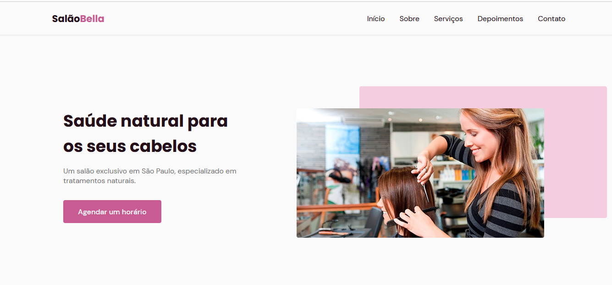

 

  

 
 ## 🚀 Tecnologias

Esse projeto foi desenvolvido com as seguintes tecnologias:

- HTML
- CSS
- JavaScript

Bibliotecas

- [Google Fonts](https://fonts.google.com/)
- [SwipeJS](https://github.com/nolimits4web/Swiper)
- [ScrollRevel](https://scrollrevealjs.org)

Utilitários

- [randomuser.me](https://randomuser.me/photos)
- [IconMoon](https://icomoon.io/app/#/select)

## 💻 Projeto

SalãoBella é uma página institucional no formato One Page, responsiva, para usar em diversos tipos de micro, pequena e média empresas. Contém as seguintes seções: Header, Navigation, Home, Sobre, Serviços, Depoimentos, Contato e Footer.
Foi apresentado e projetado ao longo das aulas pelo professor Mayk Brito, no evento da NLW 6 ROCKETSEAT "MISSÃO ORIGIN" 25/06/2021.
 
## 📝 Aprendizado

 Adquirir uma boa base inicial de HTML, CSS e JAVASCRIPT com este projeto. 😀
 
 
## 📝 Licença

Esse projeto está sob a licença MIT. Veja o arquivo [LICENSE](./LICENSE.MD) para mais detalhes.

 
 ============================================================ 

 ### 📝 LOG DEV 01/07/2021 - Anderson Nascimento

 - Corrigido Bug redirecionamento botão Home;

 - Corrigido Bug redirecionamento botão Agendar;

 - Adicionado Link Contato Email.

            
  ============================================================ 
